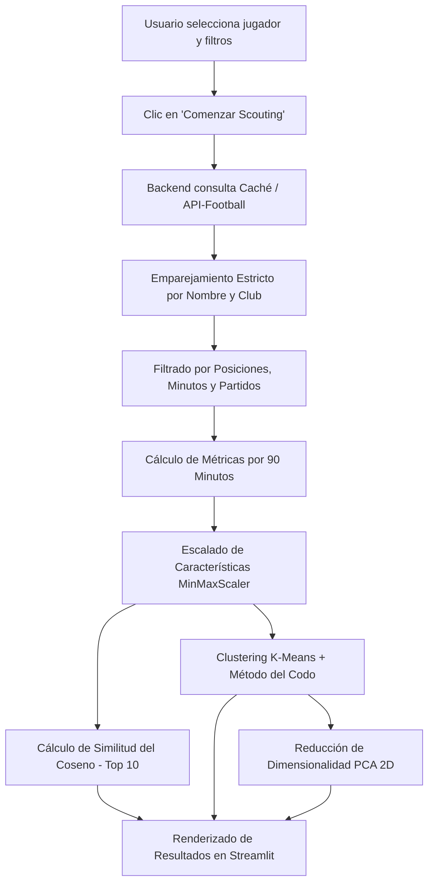

# ⚽ Scouting de Jugadores Parecidos

Sistema avanzado de **scouting y recomendación de futbolistas** basado en Machine Learning. Permite encontrar qué jugadores de las 5 grandes ligas europeas tienen el **estilo de juego y rendimiento estadístico más parecido** a un jugador de referencia, utilizando métricas normalizadas por 90 minutos, escalado de características, **similitud del coseno** y **clustering K-Means con reducción dimensional PCA**.

---

## 📋 Tabla de Contenidos
- [Características Principales](#-características-principales)
- [Arquitectura del Sistema](#-arquitectura-del-sistema)
- [Requisitos Previos](#-requisitos-previos)
- [Instalación y Configuración](#-instalación-y-configuración)
- [Cómo Inicializar el Sistema](#-cómo-inicializar-el-sistema)
- [¿Cómo Funciona el Sistema?](#-cómo-funciona-el-sistema)
- [Métricas y Variables Analizadas](#-métricas-y-variables-analizadas)
- [Estructura del Proyecto](#-estructura-del-proyecto)

---

## 🚀 Características Principales

1. **Catálogo Precargado (>3.000 Jugadores):** Búsqueda con autocompletado en memoria y filtrado en tiempo real sin saturar la cuota de la API al escribir o cambiar filtros.
2. **Formulario No Bloqueante:** Selección fluida de jugador, posiciones, minutos mínimos, partidos mínimos y ligas. Toda la computación se activa únicamente al hacer clic en *"🔍 Comenzar Scouting"*.
3. **Métricas por 90 Minutos:** Normalización justa de estadísticas por tiempo efectivo de juego para comparar futbolistas en igualdad de condiciones.
4. **Similitud del Coseno:** Comparación del vector de características multidimensional (escalado con `MinMaxScaler`) para extraer el **Top 10 de jugadores más afines**.
5. **K-Means + Método del Codo:** Agrupación inteligente de perfiles de juego seleccionando el número óptimo de clusters $K$. La gráfica del método del codo se genera y guarda automáticamente en `outputs/elbow_method.png`.
6. **Visualización Interactiva PCA 2D:** Proyección del espacio de características a dos componentes principales (PC1 y PC2) en un gráfico interactivo con Plotly donde el jugador seleccionado aparece resaltado con un anillo rojo.
7. **Comparativa Visual (8 Gráficos de Barras):** Comparación métrica a métrica entre el **Jugador Seleccionado**, el **Top 1 Más Parecido** y el **Promedio de su Cluster**.
8. **Sistema de Caché en Disco:** Almacenamiento local de respuestas en `cache/` para maximizar el ahorro del plan gratuito de API-Football (100 peticiones/día).

---

## 🏗️ Arquitectura del Sistema

El proyecto está diseñado con una arquitectura desacoplada en dos capas:

- **Backend (FastAPI - Puerto 8002):** API REST encargada de la lógica de negocio, clientes de APIs externas, filtrado, normalización de datos, cálculo de similitud y clustering.
- **Frontend (Streamlit - Puerto 8502):** Interfaz visual interactiva, minimalista y responsiva que consume la API del backend.

```
┌─────────────────────────────────┐
│     Streamlit UI (Port 8502)    │
│  - Buscador de jugador          │
│  - Filtros y Parámetros         │
│  - Visualizaciones Plotly       │
└────────────────┬────────────────┘
                 │ HTTP (JSON)
┌────────────────▼────────────────┐
│      FastAPI (Port 8002)        │
│  - POST /api/scouting           │
│  - GET /api/catalog             │
│  - GET /api/status              │
└────────────────┬────────────────┘
                 │
  ┌──────────────┼──────────────┐
  ▼              ▼              ▼
┌────────────┐ ┌────────────┐ ┌─────────────┐
│API-Football│ │Football-   │ │Caché Local  │
│  (Stats)   │ │  Data.org  │ │ (JSON Disk) │
└────────────┘ └────────────┘ └─────────────┘
```

---

## 📦 Requisitos Previos

- **Python 3.12** o superior.
- Gestor de paquetes **[uv](https://docs.astral.sh/uv/)** (recomendado) o **pip**.
- Conexión a Internet y claves de API configuradas en el archivo `.env`.

---

## ⚙️ Instalación y Configuración

### 1. Clonar o abrir el directorio del proyecto
```bash
cd "c:\Users\Mikel\Desktop\PROYECTOS\Jugadores similares"
```

### 2. Configurar variables de entorno (`.env`)
Asegúrate de que existe el archivo `.env` en la raíz del proyecto con tus credenciales:
```env
FOOTBALL_API_KEY=tu_api_key_de_api_football
FOOTBAL_DATA_ORG_API_KEY=tu_api_key_de_football_data
```

### 3. Instalar dependencias con `uv`
```bash
uv add streamlit fastapi uvicorn requests python-dotenv scikit-learn pandas numpy plotly httpx matplotlib
```
*(Si usas `pip` estándar: `pip install -r requirements.txt`)*

---

## 🚦 Cómo Inicializar el Sistema

Para ejecutar el sistema se requieren **dos terminales abiertas simultáneamente**:

### Terminal 1: Backend FastAPI (Puerto 8002)
```bash
uv run python -m uvicorn src.api:app --host 127.0.0.1 --port 8002
```
> El backend quedará escuchando en `http://127.0.0.1:8002` (puedes verificar su estado en `http://127.0.0.1:8002/api/health`).

### Terminal 2: Frontend Streamlit (Puerto 8502)
```bash
uv run streamlit run app.py --server.port 8502
```
> La aplicación se abrirá automáticamente en tu navegador en **`http://localhost:8502`**.

---

## 🧠 ¿Cómo Funciona el Sistema? (Paso a Paso)

Cuando utilizas la aplicación, el sistema sigue este flujo de procesamiento:



### 1. Búsqueda y Selección en el Frontend
- El usuario dispone de un desplegable con autocompletado en memoria con más de 3.000 futbolistas de las 5 grandes ligas (Premier League, La Liga, Serie A, Bundesliga y Ligue 1).
- Escribir cualquier nombre (ej. *"Arda Guler"*, *"Cole Palmer"*, *"Bukayo Saka"*, *"Pedri"*) filtra la lista instantáneamente sin consumir peticiones de API.

### 2. Formulario y Filtros
- Los filtros permiten acotar las posiciones deseadas (delanteros, extremos, mediocentros, laterales, centrales...), el umbral mínimo de minutos disputados, el número mínimo de partidos y las ligas donde buscar candidatos similares.
- Gracias a `st.form`, la interfaz permanece reactiva y no hace llamadas a la red hasta que se pulsa **"Comenzar Scouting"**.

### 3. Recuperación de Datos y Emparejamiento Inteligente
- El backend comprueba si los datos de la liga solicitada están en la caché local (`cache/`). Si no están, los descarga respetando los límites de paginación del plan gratuito de API-Football y los guarda en disco.
- Un algoritmo de puntuación estricta (`score_player_match`) asocia al jugador con su club de procedencia para evitar falsos positivos con nombres o apellidos comunes.

### 4. Normalización Estadística (Per 90)
- Las métricas acumulativas de volumen (goles, tiros, pases, regates, entradas, intercepciones) se dividen entre los minutos jugados y se multiplican por 90:
  $$\text{Métrica}_{p90} = \frac{\text{Total Métrica}}{\text{Minutos Jugados}} \times 90$$
- Las asistencias y tarjetas amarillas se conservan en valores totales del periodo para reflejar su impacto global.

### 5. Vector de Características y Similitud del Coseno
- Se construye un vector de 9 dimensiones para cada jugador y se normaliza al rango $[0, 1]$ mediante `MinMaxScaler`:
  $$\mathbf{x}_{\text{escalado}} = \frac{\mathbf{x} - \mathbf{x}_{\min}}{\mathbf{x}_{\max} - \mathbf{x}_{\min}}$$
- Se calcula la similitud del coseno entre el vector del jugador seleccionado ($\mathbf{u}$) y cada candidato ($\mathbf{v}$):
  $$\text{Similitud}(\mathbf{u}, \mathbf{v}) = \frac{\mathbf{u} \cdot \mathbf{v}}{\|\mathbf{u}\| \|\mathbf{v}\|}$$
- Se ordenan de mayor a menor para extraer el **Top 10 más similar**.

### 6. Clustering K-Means y Método del Codo
- Se evalúa la inercia para diferentes valores de $K \in [2, 10]$ y se detecta el punto de inflexión ("codo").
- La gráfica generada se guarda en `outputs/elbow_method.png`.
- Se asigna cada jugador a su cluster correspondiente.

### 7. Análisis de Componentes Principales (PCA)
- Se reducen las 9 dimensiones a 2 componentes principales (PC1 y PC2) para proyectar a todos los futbolistas analizados en un plano cartesiano interactivo de dispersión coloreado por cluster, con el jugador analizado destacado con un anillo circular rojo.

### 8. Comparativa Detallada
- Se calculan los valores del jugador analizado, del jugador #1 más parecido y la media del cluster en 8 métricas clave para representarlos en una cuadrícula de 8 gráficos de barras interactivos.

---

## 📊 Métricas y Variables Analizadas

| Abreviatura | Nombre Completo | Tipo de Cálculo | Descripción |
| :---: | :--- | :---: | :--- |
| **PJ** | Partidos Jugados | Total | Número de encuentros disputados en la temporada. |
| **G** | Goles por 90 min | Per 90 | Frecuencia goleadora normalizada cada 90 minutos. |
| **AS** | Asistencias | Total | Pases de gol totales repartidos. |
| **PC** | Pases Completados | Per 90 | Número de pases exitosos completados cada 90 min. |
| **%P** | Porcentaje de Pases | Ratio $[0, 1]$ | Porcentaje de acierto en entregas. |
| **TR** | Tiros Realizados | Per 90 | Disparos totales intentados cada 90 min. |
| **RC** | Regates Completados | Per 90 | Dribles con éxito completados cada 90 min. |
| **ER** | Entradas Realizadas | Per 90 | Tackles y entradas defensivas exitosas cada 90 min. |
| **ID** | Intercepciones Defensivas | Per 90 | Balones cortados e interceptados cada 90 min. |
| **AM** | Tarjetas Amarillas | Total | Amonestaciones recibidas en el periodo. |

---

## 📁 Estructura del Proyecto

```
Jugadores similares/
├── app.py                      # Frontend en Streamlit (Puerto 8502)
├── requirements.txt            # Dependencias del proyecto
├── README.md                   # Documentación completa del sistema
├── .env                        # Claves de API (FOOTBALL_API_KEY, FOOTBAL_DATA_ORG_API_KEY)
├── cache/                      # Caché en disco de peticiones y catálogo de jugadores
│   └── players_catalog.json    # Catálogo de >3.000 futbolistas de las 5 grandes ligas
├── outputs/                    # Gráficas generadas automáticamente
│   └── elbow_method.png        # Gráfica del método del codo (K-Means)
└── src/                        # Código fuente modular
    ├── __init__.py
    ├── config.py               # Configuración central, ligas, posiciones y constantes
    ├── api.py                  # Servidor backend con FastAPI (Puerto 8002)
    ├── data_service.py         # Orquestador del pipeline de datos y búsqueda estricta
    ├── api_football_client.py  # Cliente API-Football v3 con control de cuota y caché
    ├── football_data_client.py # Cliente Football-Data.org (plantillas y equipos)
    ├── similarity.py           # Escalado MinMaxScaler y Similitud del Coseno
    └── clustering.py           # K-Means, Método del Codo y Reducción PCA 2D
```

---

## 🛠️ Tecnologías Utilizadas

- **Lenguaje:** Python 3.12
- **Backend API:** FastAPI, Uvicorn, Pydantic
- **Frontend UI:** Streamlit
- **Machine Learning & Estadística:** Scikit-Learn (`MinMaxScaler`, `cosine_similarity`, `KMeans`, `PCA`), NumPy, Pandas
- **Visualización de Datos:** Plotly (`plotly.express`, `plotly.graph_objects`), Matplotlib
- **Conectividad y APIs:** Requests, HTTPX, Python-Dotenv
